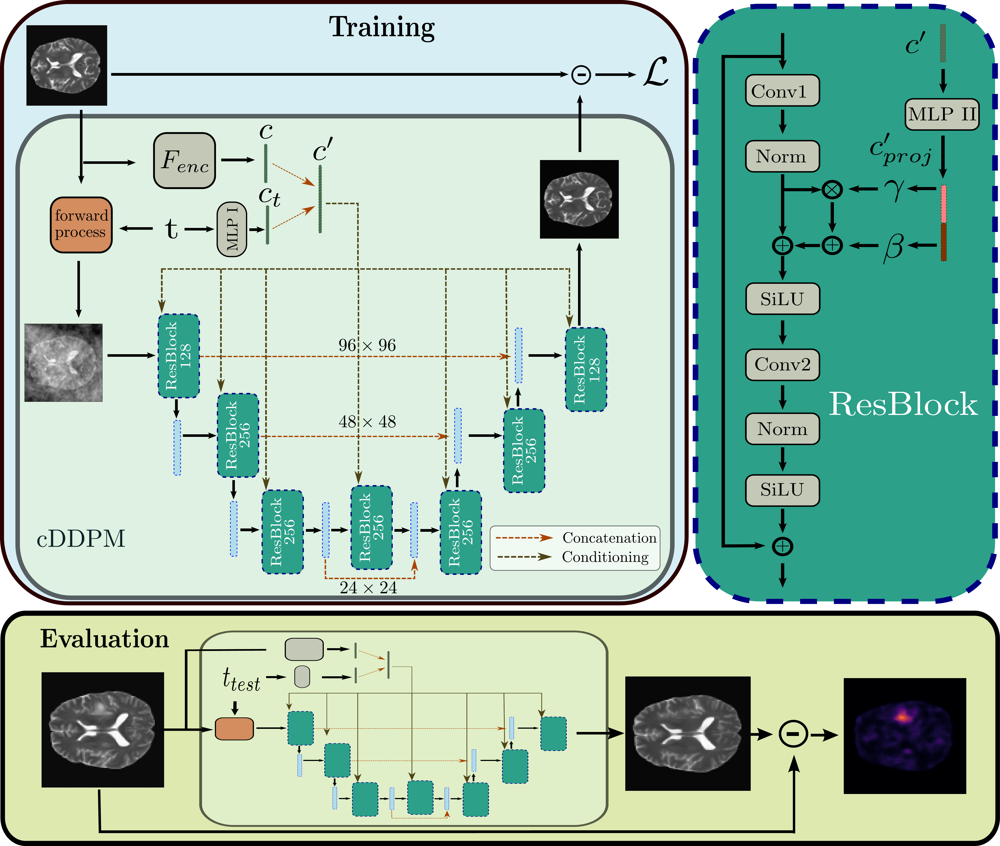

# Conditioned-Diffusion-Models-UAD
Codebase for the paper [Guided Reconstruction with Conditioned Diffusion Models for Unsupervised Anomaly Detection in Brain MRIs](https://www.sciencedirect.com/science/article/pii/S0010482525000101).

**Abstract**: 
Unsupervised anomaly detection in Brain MRIs aims to identify abnormalities as outliers from a healthy training distribution. Reconstruction-based approaches that use generative models to learn to reconstruct healthy brain anatomy are commonly used for this task. Diffusion models are an emerging class of deep generative models that show great potential regarding reconstruction fidelity. However, they face challenges in preserving intensity characteristics in the reconstructed images, limiting their performance in anomaly detection. To address this challenge, we propose to condition the denoising mechanism of diffusion models with additional information about the image to reconstruct coming from a latent representation of the noise-free input image. This conditioning enables high-fidelity reconstruction of healthy brain structures while aligning local intensity characteristics of input-reconstruction pairs. We evaluate our method's reconstruction quality, domain adaptation features and finally segmentation performance on publicly available data sets with various pathologies. Using our proposed conditioning mechanism we can reduce the false-positive predictions and enable a more precise delineation of anomalies which significantly enhances the anomaly detection performance compared to established state-of-the-art approaches to unsupervised anomaly detection in brain MRI. Furthermore, our approach shows promise in domain adaptation across different MRI acquisitions and simulated contrasts, a crucial property of general anomaly detection methods.
## Model Architecture

## Data
We use the IXI data set, the BraTS21, MSLUB, ATLAS_v2 and WMH data set for our experiments. 
You can download/request the original data sets here:

* [IXI](https://brain-development.org/ixi-dataset/)
* [BraTS21](http://braintumorsegmentation.org/)
* [MSLUB](https://lit.fe.uni-lj.si/en/research/resources/3D-MR-MS/)
* [ATLAS v2](https://fcon_1000.projects.nitrc.org/indi/retro/atlas.html)
* [WMH](https://dataverse.nl/dataset.xhtml?persistentId=doi:10.34894/AECRSD )

If you’d like to use our preprocessed data, we’ve made preprocessed versions of the datasets available [here](https://1drv.ms/u/c/66229029a9e95461/EVb21X1kmXxCh_xfqMNmzH8B1Rqe_wWDHYzoQuiGj94k3Q?e=wjFP6h) (approx. 37G). 

After downloading, the directory structure of <DATA_DIR> should look like this: 

    <DATA_DIR>
    ├── Train
    │   ├── ixi
    │   │   ├── mask
    │   │   ├── t2
    │   │   └── t1
    ├── Test
    │   ├── Brats21
    │   │   ├── mask
    │   │   ├── t2
    │   │   └──seg
    │   ├── MSLUB
    │   │   ├── mask
    │   │   ├── t2
    │   │   └── seg
    │   ├── ATLAS_v2
    │   │   ├── mask
    │   │   ├── t1
    │   │   └── seg
    │   └── ...
    ├── splits
    │   ├──  Brats21_test.csv        
    │   ├──  Brats21_val.csv   
    │   ├──  MSLUB_val.csv 
    │   ├──  MSLUB_test.csv
    │   ├──  IXI_train_fold0.csv
    │   ├──  IXI_train_fold1.csv 
    │   └── ...                
    └── ...

You should then specify the location of <DATA_DIR> in the pc_environment.env file. Additionally, specify the <LOG_DIR>, where runs will be saved. 

## Environment Set-up
To download the code type 

    git clone git@github.com:FinnBehrendt/conditioned-Diffusion-Models-UAD.git

In your linux terminal and switch directories via

    cd conditioned-Diffusion-Models-UAD

To setup the environment with all required packages and libraries, you need to install anaconda first. 

Then, run 

    conda env create -f environment.yml -n cddpm-uad

and subsequently run 

    conda activate cddpm-uad
    pip install -r requirements.txt

to install all required packages.

## Run Experiments

To run the training and evaluation of the cDDPM without pretraining, you can simply run 

    python run.py experiment=cDDPM/DDPM_cond_spark_2D model.cfg.pretrained_encoder=False

For better performance, you can pretrain the encoder via masked pretraining (Spark) 

    python run.py experiment=cDDPM/Spark_2D_pretrain

Having pretrained the encoder, you can now run 

    python run.py experiment=cDDPM/DDPM_cond_spark_2D encoder_path=<path_to_pretrained_encoder>

The <path_to_pretrained_encoder> will be placed in the <LOG_DIR>. Alternatively, you will find the best checkpoint path printed in the terminal. 

## Citation
If you make use of our work, you can cite it via

    
    @article{BEHRENDT2025109660,
    abstract = {The application of supervised models to clinical screening tasks is challenging due to the need for annotated data for each considered pathology. Unsupervised Anomaly Detection (UAD) is an alternative approach that aims to identify any anomaly as an outlier from a healthy training distribution. A prevalent strategy for UAD in brain MRI involves using generative models to learn the reconstruction of healthy brain anatomy for a given input image. As these models should fail to reconstruct unhealthy structures, the reconstruction errors indicate anomalies. However, a significant challenge is to balance the accurate reconstruction of healthy anatomy and the undesired replication of abnormal structures. While diffusion models have shown promising results with detailed and accurate reconstructions, they face challenges in preserving intensity characteristics, resulting in false positives. We propose conditioning the denoising process of diffusion models with additional information derived from a latent representation of the input image. We demonstrate that this conditioning allows for accurate and local adaptation to the general input intensity distribution while avoiding the replication of unhealthy structures. We compare the novel approach to different state-of-the-art methods and for different data sets. Our results show substantial improvements in the segmentation performance, with the Dice score improved by 11.9%, 20.0%, and 44.6%, for the BraTS, ATLAS and MSLUB data sets, respectively, while maintaining competitive performance on the WMH data set. Furthermore, our results indicate effective domain adaptation across different MRI acquisitions and simulated contrasts, an important attribute for general anomaly detection methods. The code for our work is available at https://github.com/FinnBehrendt/Conditioned-Diffusion-Models-UAD.},
	author = {Finn Behrendt and Debayan Bhattacharya and Robin Mieling and Lennart Maack and Julia Kr{\"u}ger and Roland Opfer and Alexander Schlaefer},
	doi = {https://doi.org/10.1016/j.compbiomed.2025.109660},
	issn = {0010-4825},
	journal = {Computers in Biology and Medicine},
	keywords = {Unsupervised anomaly detection, Segmentation, Brain MRI, Diffusion models},
	pages = {109660},
	title = {Guided reconstruction with conditioned diffusion models for unsupervised anomaly detection in brain MRIs},
	url = {https://www.sciencedirect.com/science/article/pii/S0010482525000101},
	volume = {186},
	year = {2025},
	bdsk-url-1 = {https://www.sciencedirect.com/science/article/pii/S0010482525000101},
	bdsk-url-2 = {https://doi.org/10.1016/j.compbiomed.2025.109660}}

  

